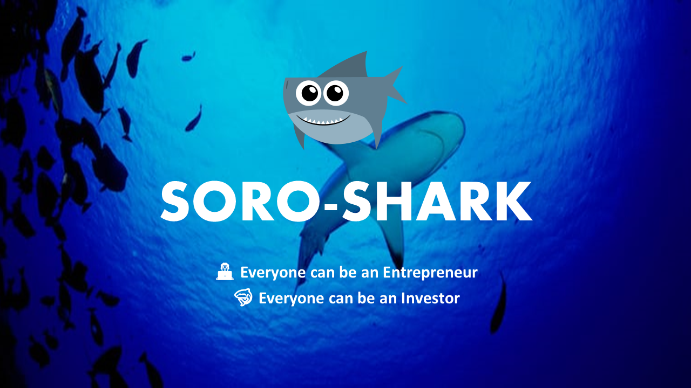
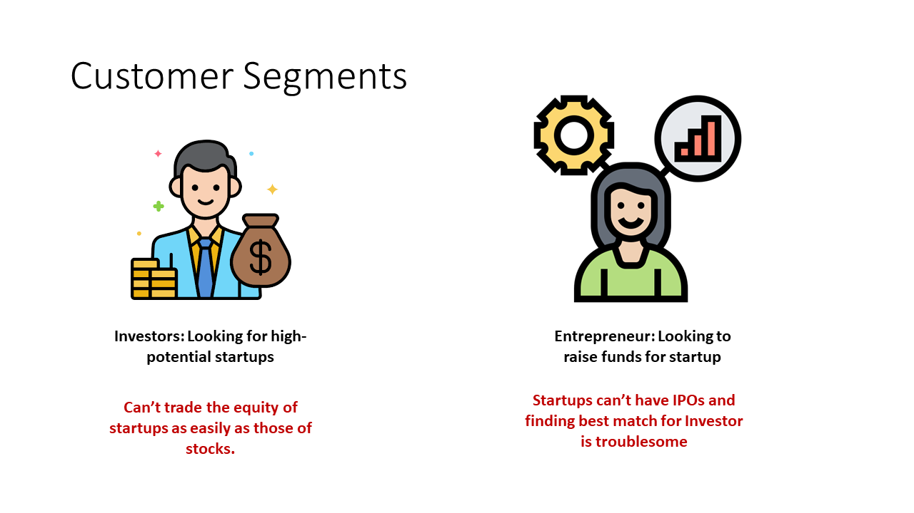
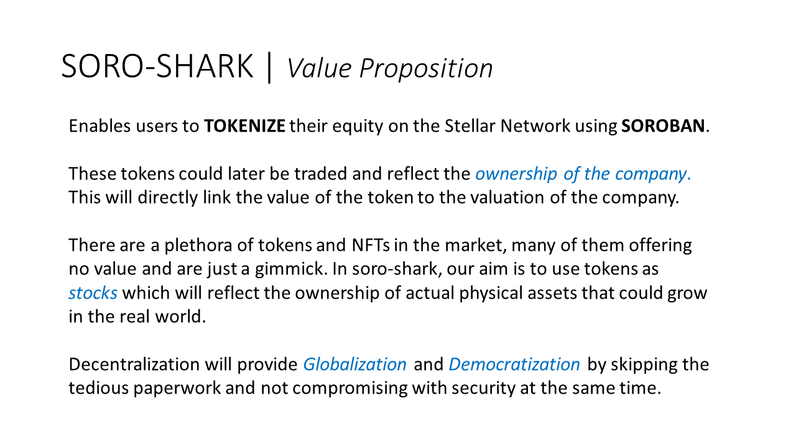
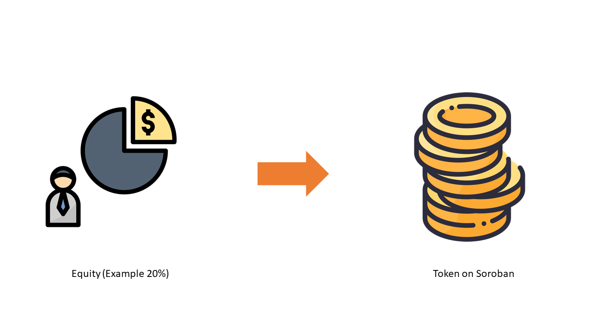
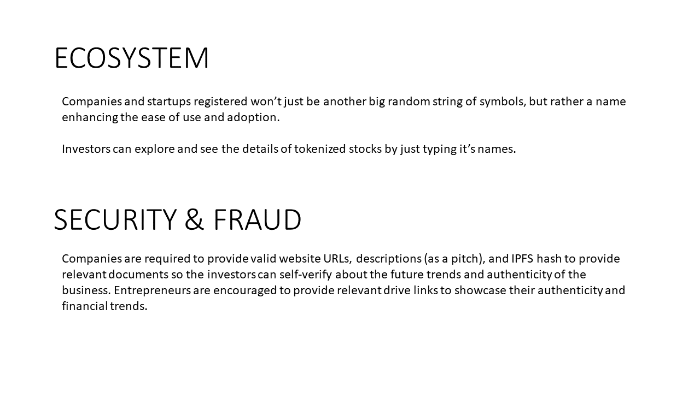
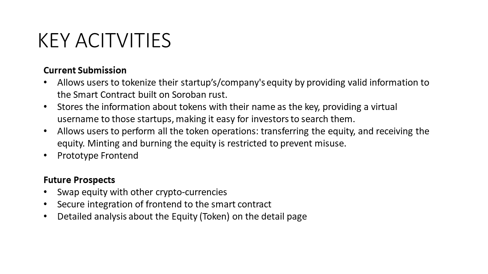
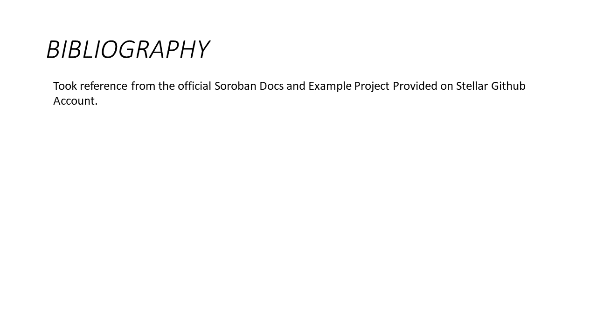

# 🦈 Soro-Shark

Soro-Shark empowers users to tokenize their equity on the Stellar Network using Soroban. These tokens serve as a digital representation of ownership in a company, and their value is intrinsically linked to the company's overall valuation.

In today's market, a plethora of tokens and NFTs offer little to no real value, often being little more than gimmicks. Soro-Shark's mission is to transform tokens into a genuine reflection of ownership in tangible assets that can appreciate in the real world.

By embracing decentralization, Soro-Shark paves the way for globalization and democratization while bypassing the often cumbersome paperwork process. This ensures that security is never compromised.

      

## 🦀Deployment and Usage
### Prerequisite
- Rust 
```bash
curl --proto '=https' --tlsv1.2 -sSf https://sh.rustup.rs | sh
```
- Target
```bash
rustup target add wasm32-unknown-unknown
```
- Soroban CLI
```bash
cargo install --locked --version 20.0.0-rc2 soroban-cli
```

### Running the project
- Deploy Contract
```bash
  npm run setup
```
- Frontend
```bash
  npm run dev
```